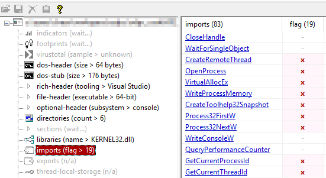

[Previous: tip 1](/evasion/tip-001/) || [Next: tip 3](/evasion/tip-003/)

# [EDR evasion tip 2/100] - Cure the Import Address Table with Dynamic API Resolution

Before a Windows program runs, the loader needs to know which functions it plans to call from system DLLs (`ntdll.dll`, `kernel32.dll`, `user32.dll`, and others).

That declared list lives in the PE as the **Import Address Table (IAT)** - think of it as a **shopping list of APIs** baked into the file on disk.

## Why EDR cares about the IAT 🔍

Static scanners do not need to execute your binary to know the APIs used. They parse the PE, walk the import directories, and the IAT and ask:

- Which DLLs are named?
- Which functions are named?
- Does this combination look like a malware, ransomware stub, or shellcode loader?

No behavior yet. Just **labels on the box**. If the shopping list screams "injection + decryption + remote thread," you already look interesting for EDRs.

## Commonly abused Windows APIs that may flag your binary if they show up in the IAT 📋

None of these are evil alone. Clean software uses them too. The tell is often **clusters** of sensitive APIs in a small, unusual binary:

- `VirtualAlloc` / `VirtualAllocEx` / `VirtualProtect` / `VirtualProtectEx`
- `WriteProcessMemory`
- `CreateRemoteThread` / `NtCreateThreadEx`
- `OpenProcess` / `OpenThread`
- `CreateProcessA` / `CreateProcessW`

## The first move: resolve APIs at runtime 🏃

If the sensitive names are sitting in the IAT, static detection is easy.

So operators often **resolve APIs dynamically** while the program runs: obtain a module handle and a function address only when needed, instead of declaring every sensitive call up front in the import table.

That **breaks the direct association** between the on-disk binary and those function names. The shopping list gets shorter. The file looks quieter to a lazy static pass.

## Catch: you trade one IOC for another ⚠️

Dynamic resolution usually still needs a few helpers to bootstrap itself. Those helpers often land right back in the IAT:

- `LoadLibrary` / `LoadLibraryEx`
- `GetModuleHandle`
- `GetProcAddress`

So you hide `VirtualAllocEx`… and advertise "I look up functions by name at runtime" instead. Defenders know that pattern too. A tiny PE whose only interesting imports are the dynamic-resolution duo is still a smell.

## Takeaway 💡

The IAT is a **static confession** of intent.
EDR uses it because it is cheap, early, and does not require detonation.

Dynamic API resolution helps - but it is not free, `yet`!! 
Tip 3 will dig into resolving those remaining bootstrap IOCs (`LoadLibrary` / `GetModuleHandle` / `GetProcAddress`) without leaving the same fingerprints.

---

*Series: EDR evasion / Tip 2 of 100*

[Previous: tip 1](/evasion/tip-001/) || [Next: tip 3](/evasion/tip-003/)

