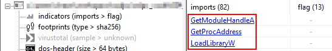

[Previous: tip 2](/evasion/tip-002/) || [Next: tip 4](/evasion/tip-004/)

# [EDR evasion tip 3/100] - Hide the APIs used for the dynamic API resolution themselves from the IAT

In [tip 2](/evasion/tip-002/), we covered why sensitive APIs in the Import Address Table are an easy static signal, and why malware often switches to **dynamic API resolution**.

That move has a catch: the resolvers themselves (`LoadLibrary`, `GetModuleHandle`, `GetProcAddress`) often still sit in the IAT. A nearly empty import table that only lists those three basically says: *"I load and resolve things at runtime."*

So tip 3 asks: can we resolve APIs without even those bootstrap imports?

## The idea 🔍

Skip the Win32 helpers. Get a handle to `ntdll.dll` already mapped in your process, then resolve two lower-level exports:

- `LdrLoadDll`: load a module
- `LdrGetProcedureAddress`: resolve a function from a loaded module

With those two addresses, you can load DLLs and resolve functions at runtime **without** putting the target APIs, or the usual Win32 resolvers, in the IAT.
Ok, but how do I get these two functions without polluting the IAT with the Win32 helpers?

## Step 1 - Find ntdll via PEB wlaking 🧱

What is the **PEB** (Process Environment Block)?

It is a Windows per-process [structure](https://www.vergiliusproject.com/kernels/x64/windows-11/25h2/_PEB) that holds a lot of process state. For us, the useful part is the **loader data**: a table of modules already mapped into the process (exe + DLLs), including each module's base address and name.

Rough flow:

1. Locate the PEB for the current process (architecture-specific; on x64 this is reached via the CPU segment register GS with 0x60 offset, which stores a pointer to the PEB of the current process).
2. Walk its Loader Data Table (LDR) for loaded modules.
3. Compare each entry's name to `ntdll.dll`.
4. When it matches, take the module's **DllBase**, that is the in-memory start of ntdll (a PE image).

No `GetModuleHandle("ntdll.dll")` required. You discovered the base by walking structures the OS already maintains.

## Step 2 - Walk ntdll's Export Address Table 📦

The Dll, a PE image, does not only *import* functions. It also **export** functions. The **Export Address Table (EAT)** lists what a DLL offers by name or ordinal.

Once you have ntdll's base:

1. Parse it as a PE in memory.
2. Find the export directory.
3. Walk exported names.
4. Match `LdrLoadDll` and `LdrGetProcedureAddress`.
5. Record their addresses (RVA + base → absolute VA).

Now you can call those two to load any module and resolve any function - without those funtions (or `GetProcAddress` / `LoadLibrary`) sitting in your IAT.

## What you gained 🗺️

- Malicious / sensitive APIs: not in the IAT
- Classic dynamic-resolution duo: not in the IAT either

On disk, the import table look far quieter than a typical "process injector IAT."

## Catch: suspicious plaintext strings in the PE and an empty IAT ⚠️

Two new smells often appear:

1. **Suspicious plaintext strings in the PE**: While walking the PEB and EAT you may compare against literal names like `ntdll.dll`, `LdrLoadDll`, and `LdrGetProcedureAddress`. Even if they are absent from the IAT, those strings can still sit in the binary. Static scanners love "sensitive API name present as a string but not imported."

2. **Empty IAT**: Hiding everything can overshoot. Real programs usually import *something*. A PE with no imports can look as weird as one stuffed with injection APIs.

So tip 3 reduces IAT noise, but it does not erase all static signals yet, it relocates them.

## Takeaway 💡

Dynamic API resolution without Win32 resolvers in the IAT is doable: **PEB → ntdll base → EAT → `LdrLoadDll` / `LdrGetProcedureAddress` → resolve the rest**.

The next problems are plaintext strings and an unnaturally empty import table. Tip 4 will look at further enhancements for those.

---

*Series: EDR evasion / Tip 3 of 100*

[Previous: tip 2](/evasion/tip-002/) || [Next: tip 4](/evasion/tip-004/)